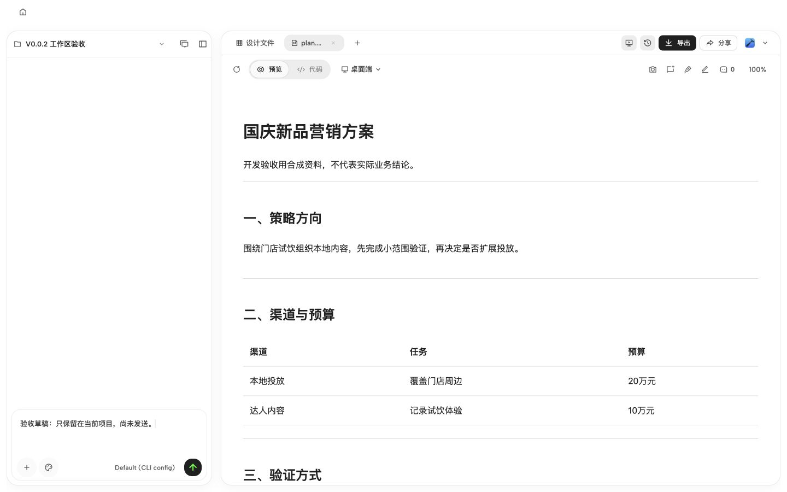

# Mokina V0.0.2 实施记录

更新：2026-10-02。当前完成的是首个开发切片：设计源文件留档、原生工作区基础布局和对应验证；不是八页设计迁移完成，也不是 V0.0.2 发布验收。

## 基线与范围

- 产品基础：当前工作树 `codex/mokina-v0.0.1`，起点 `67d5717`。本次不修改已有用户资料及 `open-design/AGENTS.md` 的既有变更，首轮按用户指令提交；不推送。
- 设计来源：Mokina V0.0.2 前端详细设计 · 中性玻璃，项目 `mokina-v0-0-2-4c39`，2026-10-02 方案工作区版本。
- [设计源文件包](designs/mokina-v0.0.2-20261002/design-baseline.zip)保存 21 个入口、样式、交互、测试和设计文档文件；[清单](designs/mokina-v0.0.2-20261002/manifest.json)记录逐文件 SHA256。它是设计参考，不能作为生产运行或状态存储。
- 最新 `PRODUCT.md` 的范围为先完成方案工作区和菜单，其余页面尚未整体推广。历史 `ACCEPTANCE.md` 的通过项不能自动覆盖 10 月 2 日更新。

## 已实现

原生 `ProjectView` 与项目创建过渡页共用工作区样式。协作栏默认 360px、可调整范围 316–470px，成果占剩余空间；沿用现有宽度存储，读取旧宽偏好时只限制当前呈现，不覆盖旧值。窄容器继续使用原有自适应收缩，两个页面用同一个宽度计算入口。

工作区增加 20px 圆角、统一间距、白色正文底及轻透明工具条。修复旧布局边距造成的左右底边 8px 偏差。样式仅挂在 Mokina 工作区，兼容模式继续使用原来的布局参数；未引入原型 localStorage 或复制示例业务逻辑。系统减少透明度与减少动态提供 CSS 降级规则，但未完成系统偏好实机切换验收。

本次未修改任务引擎、项目/资料存储、候选采用、导出服务和会话恢复逻辑，原有功能入口继续使用原生组件。不存在新的 API/CLI 能力。

## 验证

环境为 Node 24.15.0、Corepack pnpm 10.33.2。首次整仓类型检查被 PATH 中旧 pnpm 10.30.1 拒绝；切换到项目既有 Corepack shim 后通过，没有修改全局安装。

| 层级 | 结果与范围 |
| --- | --- |
| 定向测试 | 5 文件、113/113 通过：原版/营销版布局、创建过渡页、项目运行隔离、章节修订恢复。新增 3 个营销布局测试覆盖默认值、旧偏好不被覆写、窄窗口和恢复。见 [测试日志](evidence/mokina-v002-workspace/tests.log)。 |
| 静态与构建 | `pnpm guard`、整仓 `pnpm typecheck`、Web 生产构建、`git diff --check` 通过。见同目录 guard/typecheck/build 日志。 |
| 真实浏览器 | 原生 API 创建独立合成项目并保存 `plan.html` 与真实 v1；浏览器读取其正文与版本面板，章节修订和选择性接续表单可达。没有运行新的营销模型任务。 |
| 双尺寸 | 1440×900、1280×800 检查无页面横向溢出。最终构建两栏顶边与底边对齐，截图和 DOM 几何读数在证据目录。 |
| 状态保持 | 键盘将协作栏 360→376；刷新保留列宽及未发送草稿。收起/恢复协作栏后草稿仍在；服务重启后项目文件与草稿可重新打开。 |
| 版本/导出入口 | 版本面板读取真实 v1 并呈现三章，导出菜单正常打开。本次未重新生成或下载 PDF，不沿用旧记录宣称本次导出验收通过。 |

生产构建检查与开发热更新曾共用构建产物，导致临时样式丢失；已停止开发服务、重建并以 `tools-dev start web --prod` 启动完成最终复核。重启期间旧浏览器标签停在连接失败页，服务恢复后新标签正常打开；不将该中间错误页作为验收结果。

## 下一批顺序

1. 工作区操作层：将章节修订、继续制作、版本身份与指定版本交付提升到明确入口；复用现有服务，补充最新布局下输入、消息滚动、菜单与真实操作回归。
2. 导航与资料：按既有宿主导航接入最近项目及资料选择呈现，确认加载、部分读取、原件变化和超限反馈；不把上传等同已使用。
3. 接续制作：绑定固定来源、品牌规范、素材和独立草稿；首个活动页任务必须验证真实生成与来源回看。
4. 整体验收：覆盖八类页面、macOS 桌面、最新材质动态表现和真实营销任务。仍需区分工程通过与专业质量签收。

V0.0.1 记录中的全量 Web 8 项历史失败仍按原记录归类，本轮未重跑全量，也未将定向通过称为全量 CI 通过。首页、全局项目侧栏、四层折射效果、修订并排界面和其他页面尚未完成新版迁移。

## 本地查看

本次隔离环境命名为 `mokina-v002`，Web 端口 18604、daemon 端口 18603；数据根遵循 `open-design/AGENTS.md` 的 Daemon data directory contract。测试项目与现有用户项目分离。

[工作区预览](http://127.0.0.1:18604/projects/749d161a-56df-4a9f-bac4-121497efe445/conversations/5a11c5eb-87de-4c0f-83fe-02950d1c680a/files/plan.html)依赖本地服务运行。

## 第二个开发切片：工作区操作入口

基础布局已提交为 `1332a09`，设计包和检查日志补充提交为 `e83fe32`。这两个提交仅包含本任务产物，未包含既有用户资料与 AGENTS.md 修改。

新增工作区顶部「修订章节」「继续制作」入口，打开原生版本面板并将键盘焦点移到对应表单。入口本身不发送请求、不自动生成候选，也不创建接续项目。缺少可选择章节时显示原因；沿用只读禁用规则。

版本面板明确显示所选版本号及「当前稿／历史稿／候选稿」，提示下载和接续使用所选版本。新增正文滚动区域，保留顶部版本身份和底部交付按钮，避免较矮窗口把表单及下载按钮截断。兼容模式保持既有布局。

验证：新增两个行为测试覆盖入口定位、打开后不启动运行、空章节反馈。最终相关两文件 11/11 通过，整仓 guard、typecheck 和 Web 生产构建通过。首跑发生一次既有修订恢复测试超时及后续确认按钮查找失败；保留 `actions-tests.log`，随后同文件重跑 9/9、最终两文件 11/11 通过，不将首跑失败隐去。本轮不宣称全量 CI 或营销模型生成验收通过。

最终浏览器使用 1280×720 短窗口复核：修订入口聚焦章节选择，接续入口聚焦章节复选框；无横向溢出，版本身份与底部下载按钮可见。点击创建接续项目后，真实生成独立项目 `7ee8211c-eb51-4176-9d76-aa5b5be48b8c`，`MOKINA-CONTINUATION.json` 仅包含 v1 的 strategy 摘录和补充背景，未包含 budget、measurement；刷新后来源文件与未发送草稿均保留。未启动模型生成，也未重新验收 PDF 导出。

证据：[接续选择](evidence/mokina-v002-workspace/actions-continuation.png)、[刷新后独立草稿](evidence/mokina-v002-workspace/actions-created-draft.png)。本切片于 2026-10-03 按用户指令提交，随后进入 /qa。

## 工作区操作层 QA（2026-10-03）

操作层已提交为 `9aba0c0`。随后按 `/qa` Standard 完成差异范围测试，发现 3 项问题，修复并提交 2 项中等级问题：

- `f3cd0b7` / `520f7d1`：接续创建后立即切换新项目标题，不再依赖刷新；保留原版账号范围逻辑。
- `0985d248` / `012d4bb2`：解除屏外 PDF 捕获对渲染帧的无限等待；保留字体、图片等待及 sandbox。

相关定向测试 298 通过、1 项既有跳过，guard、类型检查及最终 Web 生产构建通过。生产构建浏览器复验确认标题即时更新、固定策略摘录和未发送草稿刷新后保留；原方案 v1 与历史 v1 均生成有效 PDF，已解析并渲染检查。修复前的两次 PDF 超时及新测先红证据未隐藏。

剩余一项 low：本地项目请求云协作状态返回 `WORKSPACE_CONTEXT_REQUIRED`，不影响本轮本地操作，按 Standard 保留。桌面 exporter socket 未运行，本轮证明的是浏览器备用导出路径；未运行新的模型生成或做专业营销签收。

[完整 QA 报告](evidence/mokina-v002-qa/qa-report-127-0-0-1-2026-10-03.md)包含前后对照、命令、有效 PDF 与残留事项。可以继续下一批导航与资料呈现开发；本轮不推送远端。
