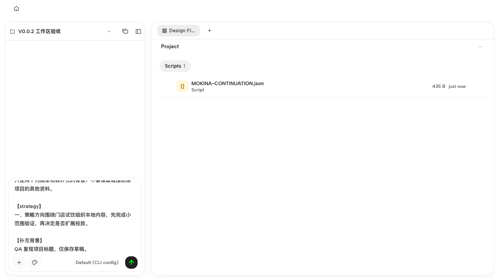
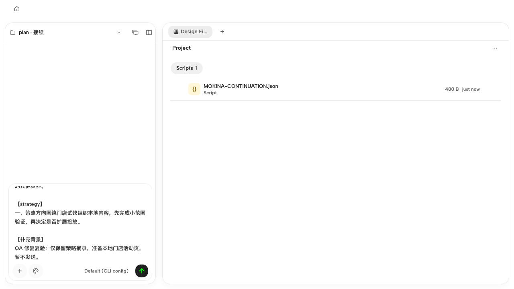
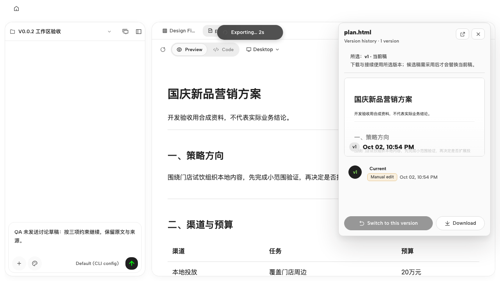
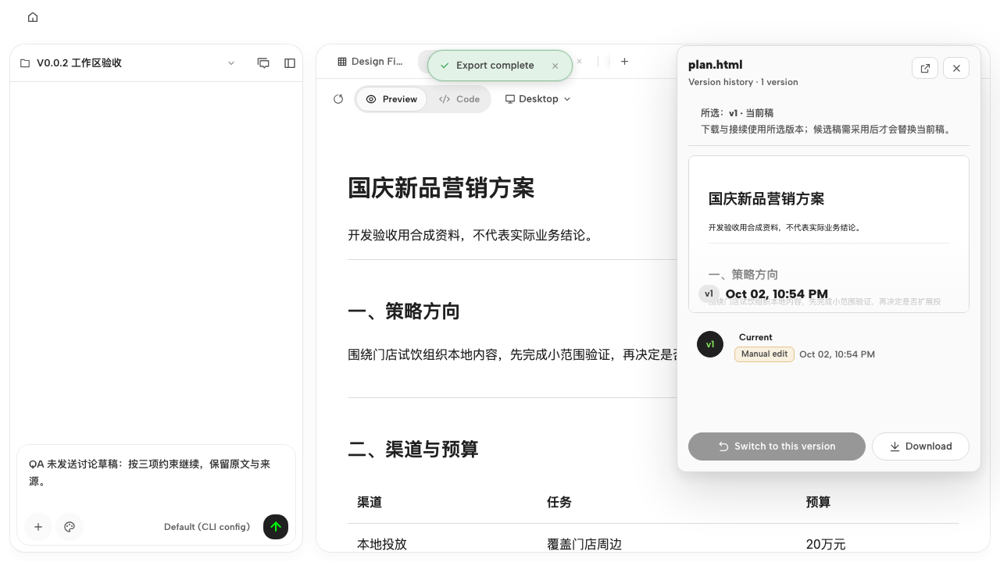
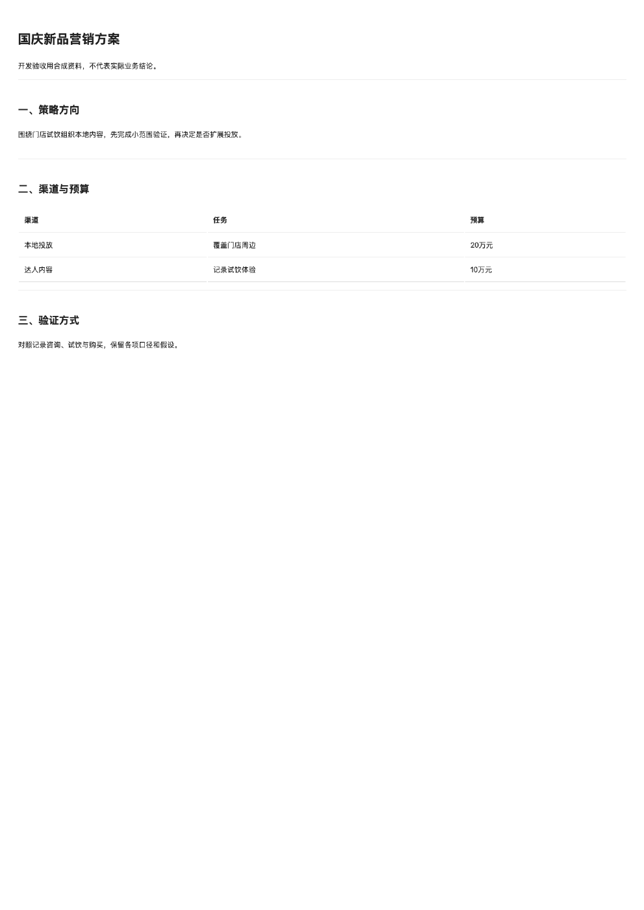

# Mokina 工作区 QA 报告

结论：**DONE_WITH_CONCERNS**。差异范围内发现 3 项问题，2 项中等级问题已修复并在生产构建的真实 Chromium 中复验；1 项低级控制台问题保留。可以继续下一批工作区开发，本报告不代表整版发布或桌面验收。

| 项目 | 内容 |
| --- | --- |
| 日期与时段 | 2026-10-03 00:15–00:42，Asia/Shanghai，约 27 分钟 |
| 地址 | http://127.0.0.1:18604 |
| 任务提交 | `9aba0c0`，工作区修订与接续操作入口 |
| 最终验证代码 | `012d4bb259c4373bbf8ed2e0eff273df741dcbb4`，`codex/mokina-v0.0.1` |
| QA 隔离分支 | `codex/mokina-v002-qa`，从 `9aba0c0` 建立；修复逐个 cherry-pick 回当前工作树 |
| PR | 本次未推送、创建或修改 PR |
| 方法 | `/qa` Standard，差异范围；对照 main，避免把完整上游导入误当本轮新增产品行为 |
| 浏览器 | gstack Chromium；本机未安装 Aside，使用 Skill 指定的后备浏览器 |
| 覆盖 | 首页、工作区文件、版本面板、接续项目；3 个合成 HTML 文件，3 次新建接续项目；1280×720 与 1440×900 |
| 证据 | 本地 QA 目录保留 26 张截图；本报告引用关键前后对照与两份实际 PDF |

## 结果与范围

| 行为 | 结果 |
| --- | --- |
| 修订入口 | 打开版本面板并聚焦「要修订的章节」，不自动发送；1280×720 下下载按钮仍可见 |
| 接续入口 | 只选 strategy 创建独立项目，源版本、固定摘录与背景保存正确；未选择的预算和衡量章节未带入 |
| 接续后的项目身份 | 修复前仍显示来源项目名；修复后立即显示 `plan · 接续`，刷新不丢名称或草稿 |
| 原项目状态 | 未发送草稿在收起、恢复、刷新及本轮服务重启后仍在；协作栏键盘调整至 376 后保留 |
| 空章节 | 普通 HTML 明确提示无可选章节；不出现可提交的修订或接续表单 |
| 历史版本 | 当前稿 v2 与所选历史稿 v1 标识、预览分开；v1 只显示接续入口，不允许按当前稿修订 |
| 指定版本 PDF | 修复后原方案 v1、双版本文件的历史 v1 均生成有效 PDF；解析并渲染核查，历史稿为「版本甲／只保留本地门店」，没有混入当前稿「版本乙」 |
| 页面布局 | 两种尺寸均无页面横向溢出；短窗口版本身份与底部下载按钮可见 |

没有启动新的模型生成任务；候选生成、专业营销质量、真实客户资料、完整八页迁移、云协作与 macOS 桌面宿主不在本轮验收结论内。使用本地合成资料，不把测试通过等同客户签收。

## 健康分：91 → 95（局部覆盖，provisional）

| 分类 | 基线 | 修复后 | 覆盖边界 |
| --- | ---: | ---: | --- |
| Console | 70 | 70 | 本地协作状态 400 按一个根因去重；导出缺陷不重复扣分 |
| Links | 100 | 100 | 已访问的本地路由与版本入口 |
| Visual | 100 | 100 | 两种窗口尺寸及版本面板 |
| Functional | 84 | 100 | 两项 medium，各扣 8，现均复验通过 |
| UX | 100 | 100 | 本轮修订、接续、导出和空状态流程 |
| Content | 100 | 100 | 版本身份及空章节反馈文案 |
| Accessibility | 100 | 100 | 入口聚焦、表单可达、键盘调整栏宽；非完整无障碍审计 |
| Performance | 不计分 | 不计分 | 未做独立性能测量 |

按 Skill 权重计算，排除 Performance 后权重和 0.9；比较使用相同覆盖。初始只发现标题问题时的临时分数为 93，补完 PDF 基线复现后固定为 91。

## ISSUE-002：接续项目显示来源项目名称

- **Severity:** medium；**Category:** functional；**Fix Status:** verified。
- 复现：进入 `plan.html` →「继续制作」→只选 strategy→填写背景→「创建接续项目（不发送）」。基线两次均出现新路由和新文件列表已加载，左侧标题仍为来源项目；刷新可规避。
- 影响：用户难以确认当前工作对象。来源项目名不应继续代表新项目。
- 根因：本地模式不读取云登录状态，标签身份范围一直为 null，导航同步被提前跳过。
- 修复：本地模式直接使用独立本地标签范围；原版仍等待账号状态。只修改 `App.tsx` 与 `collab/tab-scope.ts`。
- 提交：主工作树 `f3cd0b7`（源码）、`520f7d1`（回归测试）；QA 分支对应 `d12ba57`、`6993742`。
- 复验：无需刷新即显示 `plan · 接续`；刷新后标题、来源文件和未发送草稿均保留。最终测试项目 `4e17098d-6f66-4925-802a-5fd10aba9122`。
- 数据证据：[固定来源](continuation-source-final.json)、[刷新后状态](continuation-state-final.json)。

修复前：

修复后：

## ISSUE-003：屏外 PDF 捕获等待渲染帧直至超时

- **Severity:** medium；**Category:** functional；**Fix Status:** verified。
- 复现：`plan.html` v1 → Download → Export as PDF。基线两次进入浏览器备用导出后等待约 45 秒，输出 `export capture timed out` 并退回打印窗口。
- 影响：正常 PDF 下载无法可靠完成；打印降级是可用替代路径，不能作为该导出能力通过的证据。
- 定位：第三次对双版本文件进行受控诊断，只把捕获 iframe 从屏外移入可见区域就立即完成，说明离屏帧调度阻塞；这一诊断本身不作为最终验收。
- 根因：捕获桥在字体和图片就绪后，无界等待两次 `requestAnimationFrame`，Chromium 对屏外 iframe 暂停帧回调。
- 修复：每帧保留正常回调并加 100ms 后备完成，清除 timer 和挂起帧；字体/图片就绪、sandbox 和隐藏位置均保持原状。只修改 `runtime/srcdoc.ts`。
- 提交：主工作树 `0985d248`（源码）、`012d4bb2`（回归测试）；QA 分支对应 `166be58`、`7970791`。
- 正常路径复验：重建并重启服务后，界面点击导出两次均完成，未移动捕获 iframe，无新的 capture timeout。
- 文件验证：通过只观察 `URL.createObjectURL` 保存生成的下载 Blob，保留原始 URL 与下载行为；不是伪造导出内容。用 pypdf 解析、pdftoppm 渲染并人工视觉核查。浏览器操作系统下载对话框未作为验证目标。
- 实际文件：[原方案 v1 PDF](plan-v1.pdf)（58,367 B，1 页）、[历史 v1 PDF](qa-versions-v1.pdf)（15,130 B，1 页）；[尺寸、哈希和元数据](pdf-verification.json)。
- 环境边界：桌面 exporter socket 未运行，前置 `/export/pdf` 返回 404 后进入浏览器备用路径；本轮没有修复 daemon 的错误分类，也没有验证桌面原生导出。

修复前等待中的画面；超时由控制台记录佐证：

修复后正常完成：

实际 PDF 渲染：

## ISSUE-001：本地项目请求云协作状态返回 400

- **Severity:** low；**Category:** console；**Fix Status:** deferred。
- 重复复现：打开或刷新本地项目，`GET /api/projects/{id}/collab/status` 返回 `WORKSPACE_CONTEXT_REQUIRED`，消息为 `an explicit workspace context is required`。
- 本轮未观察到本地文件、草稿或接续操作因此失败。Standard 只修 critical/high/medium，本项保留；没有把云协作视为已验收。
- 证据：[响应](collab-status-final.json)、[基线控制台](console-before-fix.txt)、[最终控制台](console-after-fix.txt)、[最终网络记录](network-after-fix.txt)。
- 后续建议：本地项目在没有 workspace context 时不要发起云协作状态读取；需保留云项目现有检查。

## 控制台与网络

| 信号 | 基线采集 | 最终累计采集 | 判断 |
| --- | ---: | ---: | --- |
| collab/status 400 | 20 | 30 | 同一低级根因，修复后仍有 10 次，非 30 项缺陷 |
| desktop PDF 404 | 3 | 5 | 两次最终导出仍触发桌面不可用降级，浏览器路径成功 |
| capture timeout | 2 | 2 | 最终新增 0 次；旧错误保留在累计日志中 |

最终代码浏览器复验从 UTC `2026-10-02T16:35` 开始。没有清空原始错误再宣称零错误。基线网络：[记录](network-before-fix.txt)。

## 工程验证与回归

相关测试共 **8 个文件，298 通过、1 项既有跳过**。仅统计不重复的两组定向测试，不是全仓 CI。

| 项目 | 结果 |
| --- | --- |
| 标签身份、导航与项目创建 | 144 通过、1 既有跳过；新增 3 项覆盖初始列表无新项目、旧响应迟到、原版账号等待 |
| 导出捕获、srcdoc、导出与版本下载 | 154 通过；新增 3 项覆盖离屏无帧、正常两帧不会重复捕获、字体等待不被绕过 |
| guard | 整仓强制检查通过，设计组件清单输出中的报告项不作为失败 |
| 类型 | 整仓 typecheck 通过；PDF 修复后 Web typecheck 再次通过 |
| 生产构建 | 最终代码 `pnpm --filter @open-design/web build` 通过，并以 `tools-dev` 重启后完成浏览器复验 |
| 差异检查 | 修改文件与提交范围 `git diff --check` 通过 |
| 独立复核 | 另一 Agent 只读检查 PDF 修复及测试，未发现阻断缺陷 |

新增测试文件：

- `open-design/apps/web/tests/components/WorkspaceTabsBar.regression-1.test.tsx`
- `open-design/apps/web/tests/runtime/srcdoc-export-capture.regression-1.test.ts`

QA 修复阶段没有修改已有测试、CI、AGENTS.md 和用户既有文档。测试先红后绿；PDF 新测初稿类型检查发现一处隐式 any，修正类型后通过。标题测试第一次命令含一个不匹配路径，已用正确路径补测。完整命令与失败说明见[验证摘要](verification-summary.md)；原始 guard/typecheck/build 日志在同目录。

## 交付判断

| 指标 | 结果 |
| --- | --- |
| 发现 | 3：critical 0，high 0，medium 2，low 1 |
| 修复 | 2：verified 2，best-effort 0，reverted 0 |
| 保留 | 1 项 low；另列桌面运行环境限制 |
| 健康分 | 91 → 95，局部覆盖 |
| 下一步 | 可继续导航与资料呈现切片；后续单列本地协作状态请求清理、桌面宿主与真实模型任务验收 |

**PR Summary:** QA found 3 issues, fixed 2, health score 91 → 95 (provisional, workspace scope).

仓库没有 TODOS.md，因此没有新增全局待办文件。本轮仅关闭自己创建的两个浏览器标签，保留本地预览服务、合成测试项目与验证证据；没有修改长期记忆或规则。
