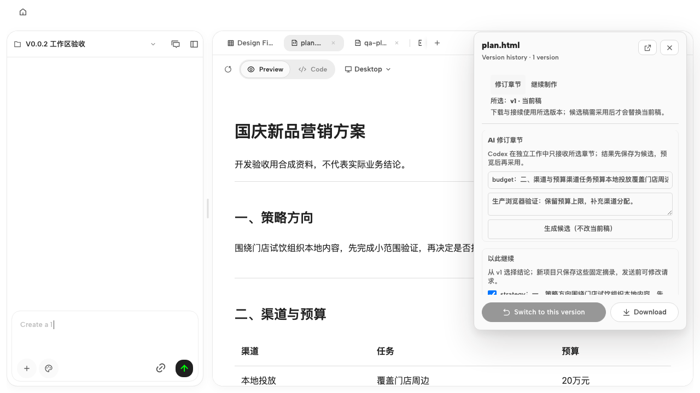
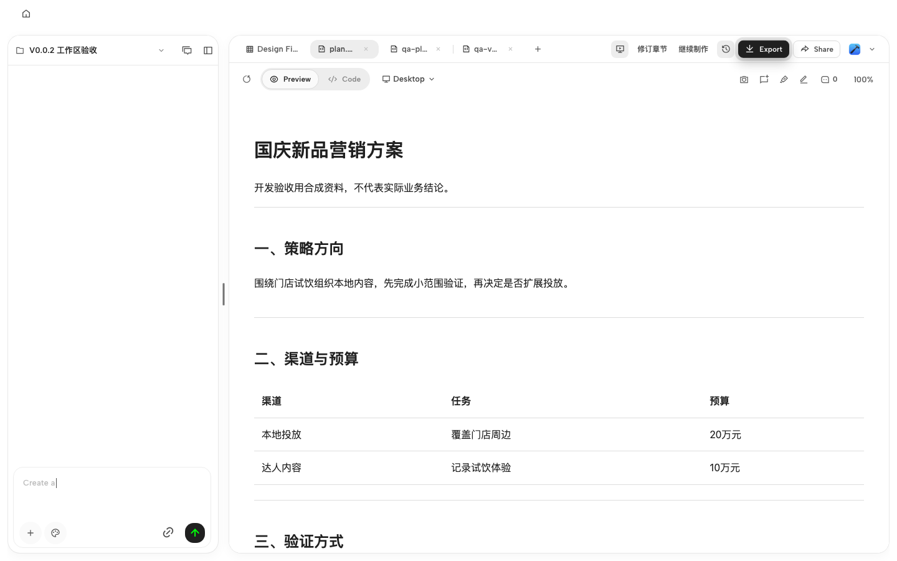

# PR #2 审查修复验证

日期：2026-10-03。仓库 `MainQuestAI/Mokina`，分支 `codex/mokina-v0.0.1` → `main`。

修复前 HEAD 为 `fc927f6604a42f062f958d0bad05a844a2323747`，base 为 `76e6b1aeb3d89bf78a6d5934cd01118aa7877dfe`。验证的生产代码与测试对应 `01c34455efe2279ff18c02ae01ec64c516ccf61d`，包含面板修复提交 `30cea79`；后续证据提交不改变实现。

## 四条意见的处理

| 意见 | 处理与结果 |
| --- | --- |
| 1：pointerdown 提前关闭 | 保留 `fc927f6` 的 `data-od-version-entry`；新入口位于面板内部，沿用 outside-dismiss 排除范围。普通鼠标切换、外部关闭均通过。 |
| 2：指示条 display:none | 保留 `display:block`；两尺寸生产页面实际可见，尺寸 3×36px。 |
| 3：打开面板后按钮隐藏 | 工具条保留首次入口，面板顶部增加常驻“修订章节 / 继续制作”。保留宿主隐藏规则，不重新显示被浮层遮住的分享等按钮。普通点击与 Enter/Space 双向切换通过。 |
| 4：指示条偏顶 | 同时覆盖 top/bottom/left/transform，生产页面两个轴的中心误差均为 0px。 |

面板内部回调只改变操作定位请求；同一 DOM 面板、所选版本、修订章节、接续勾选和两类未发送草稿保持。操作切换未创建项目或模型运行。

## 自动化与生产页面

- 6 个聚焦 Vitest 文件合计 **46 个用例通过**：修订恢复/入口 13、版本下载 13、Mokina 分隔布局 3、祖先圆角裁剪 4、聊天卡片样式 11、网格过渡 2。日志分两次执行，最新入口文件结果见 `logs/pr2-actions-final.log`，其他文件见 `logs/pr2-focused-final.log`。后者命令中曾误写网格文件名，因此只收集了 5 文件；随后已按正确文件名补跑，未把漏收集计作通过。
- 持久 Playwright 回归 `open-design/e2e/ui/mokina-workspace-actions.test.ts`：3/3，通过单 worker 和两 worker fullyParallel 两种执行模型；增加截图附件后的最终运行也是 3/3，无 skipped、flaky 或 unexpected。汇总见 [ui-runs.json](ui-runs.json)。
- 生产构建使用 `OD_WEB_OUTPUT_MODE=server pnpm --filter @open-design/web build`，经 `tools-dev --prod` 重启；在完整工作区、真实 portal 和生产 CSS 下，1280×720 与 1440×900 均完成普通鼠标/键盘验收。结果包含实际加载的 Next 资源名，见 [production-actions.json](production-actions.json)。
- 覆盖指示条几何、鼠标拖拽、ArrowRight 调整、聊天滚动条命中，以及实际聊天祖先无圆角裁剪。异常情况覆盖空版本、无章节、历史稿不能修订、内容读取延迟和只读限制，包括面板打开后权限变为只读。
- `pnpm guard`、根级 `pnpm typecheck`、最终 Web/E2E 类型检查、默认静态 Web build 和 server Web build 均通过。未执行整仓完整 UI 池；本地检查不代表远端 CI 全绿。

## 聊天滚动约束与性能边界

聊天外层保留圆角背景、边框和阴影，改为 `overflow:visible`；内部 pane 使用透明背景并保持无圆角的矩形裁剪。原有祖先守卫加入真实 Mokina CSS Module 类及规则，在旧代码上先失败、修复后通过。

生产页面使用同一 headed Chrome 154.0.8037.97、1440×900、24 条合成长聊天和相同滚轮输入进行前后对照。UI 动作 smoke 另使用 Playwright Chromium 148。

| 检查 | 修复前 | 修复后 |
| --- | ---:| ---:|
| 空闲会话真实滚轮可达范围 | 0–26,534px | 0–26,534px |
| 60 次 ScrollUpdate 的 PostingHitTestToMainThread | 60 | 0 |
| 模拟流式 11 次 ScrollUpdate 的同类事件 | 11 | 0 |
| 流式上翻后，新增 4 个 chunk 时的位置 | 24,161.5px 保持 | 24,161.5px 保持 |
| 回到底部后的最终位置 / 最大位置 | 39,105 / 39,105px | 39,105 / 39,105px |

两边均未复现完整产品卡死。结果支持本次样式修复改善了滚动命中测试路径，不是实际卡顿、帧率或 Electron Host 性能已经全面解决的证明。流式输入采用 HTTP SSE mock，真实网页消费事件并渲染；没有真实模型或 daemon agent 运行，也没有通过写 scrollTop、注入 CSS 或修改 DOM 取得滚轮结果。

祖先样式、逐步位置及计数保存在本目录的 `scroll-*.json`。原始 trace 压缩文件保留于本地 `open-design/.tmp/pr2-scroll-diagnostics/`，大小与 SHA-256 见 [local-trace-manifest.json](local-trace-manifest.json)，未将 18MB 诊断包写入仓库。

浅色、降低透明度与创建交接均有截图并已目视检查。产品当前强制浅色，OS dark 模拟后仍为 `data-theme=light`，未声称实现了产品深色模式验收。创建交接使用空 mock 输出，最终“暂无可预览文件”只作为受控夹具的失败态，不计模型生成成功。

## 首次失败与剩余边界

- 修复前普通点击因隐藏而超时；新增面板内入口组件断言先出现 2 failed / 8 passed，见 `logs/pr2-actions-red.log`。
- 新 Mokina 祖先守卫先出现 1 failed / 3 passed，定位 `.split-chat-slot`；修复后 4/4。
- 邻近旧样式测试用源码字符串固定要求宽度常量为 4，无法识别原 PR 已有的 Mokina 16px 分支。确认输入与旧 HEAD 一致后，将它改为断言上游模式实际导出值为 4；Mokina 宽度由其独立测试覆盖。
- 首轮新 UI 测试把版本卡和章节 select 的 option 一并匹配，已限定为版本 listbox，后续完整运行均通过。
- 初次生产 after 抓取仍使用旧 bundle，未计通过，结果保留在 `scroll-failed-stale-bundle-summary.json`。重新构建/重启后，先确认新 CSS 生效再重跑全部生产检查。
- 独立只读代码复查未发现阻断缺陷；复查指出的只读面板按钮覆盖缺口已补测通过。远端复审结果另行跟踪，不自动合并。

本轮未扩展到完整页面迁移、桌面宿主、云协作、多页导出或营销专业质量签收；用户原有 AGENTS.md 及未跟踪文档均未纳入修复提交。
