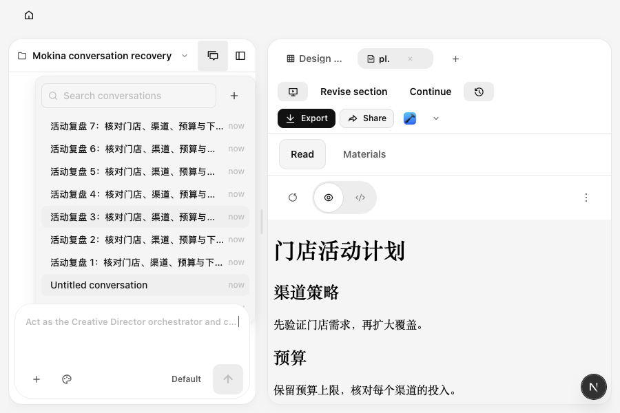
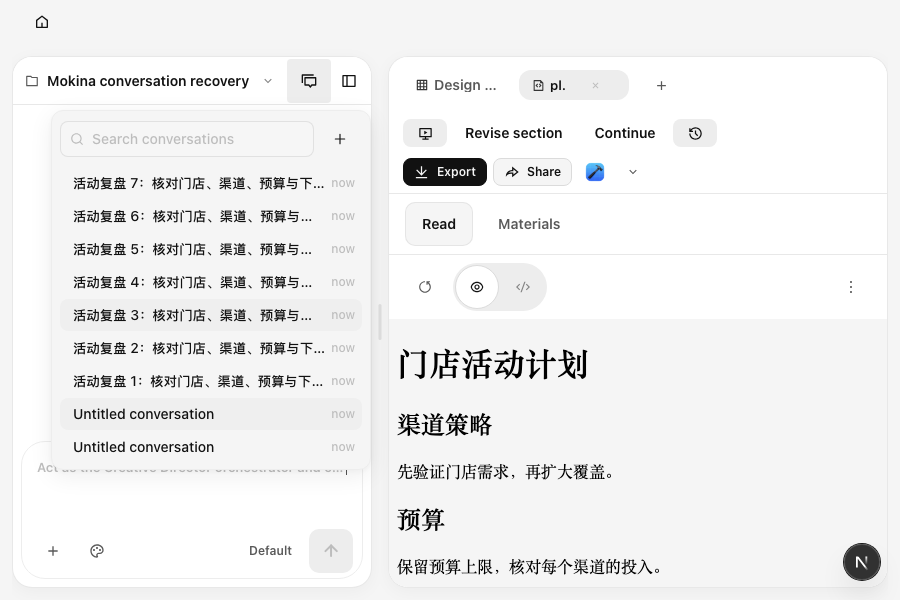

# P03 会话历史菜单：可操作性与恢复证据

2026-10-11。真实本地 daemon 保存项目、两个不同内容的会话，以及 14 条长标题历史记录。页面操作使用真实 Chromium 点击、滚轮和键盘；本检查没有模拟或发送模型运行。

最初在 1440×900、900×600 均无法点击菜单的“新建会话”：按钮可见且可用，实际命中却是 `chat-log`。Mokina 玻璃工具栏产生独立层叠上下文，菜单自身的层级无法越过该上下文。

只提高工具栏层级后，1440×900 完整流程通过；900×600 的长列表底部仍被固定输入框遮挡。这次真实失败进一步定位到 `.app` 入场动画保留末帧形成的外层隔离。最终修复仅包含两条局部样式：历史菜单打开时提升工具栏层级；Mokina 入场动画结束后释放末帧，基态仍为相同的不透明显示。没有更换菜单、改动会话状态或增加定位逻辑。

最终两个尺寸均通过：真实新建会话、16 行历史滚动及底部点击、按现有 ID 搜索、切换时消息与草稿隔离、刷新后恢复原会话和草稿、搜索框聚焦、Escape 和外点关闭、继续输入可发送。相关 E2E 类型检查通过。

## 同数据、同视口：900×600

以下均是相同项目内容、16 条历史记录和相同滚动位置。修复前最后一条历史会话被输入框覆盖，浏览器无法点击；修复后菜单完整覆盖输入框，旧会话可点击。项目与会话 UUID 在隔离环境中重新生成，不参与视觉对照。

修复前（仅顶部新建按钮可用，长菜单仍受遮挡）：

最终修复后：

原始两尺寸红例、进一步的小窗口失败和最终 2/2 通过记录，分别保留于 `output/maturity-2026-10-11/conversation-red*`、`conversation-partial-results.json` / `conversation-final/`、`conversation-verified*`。最终报告包含菜单截图、实际视口、点击命中与祖先层叠诊断，首次最终执行通过，未依赖重试或强制点击。

另一个历史通用会话回归仍依赖上游的 `designs-new-project` 入口，无法直接用于 Mokina。本轮在现有 `mokina-maturity.test.ts` 中补齐上述专用回归，沿用隔离生命周期；没有为了适应旧测试修改产品入口。
