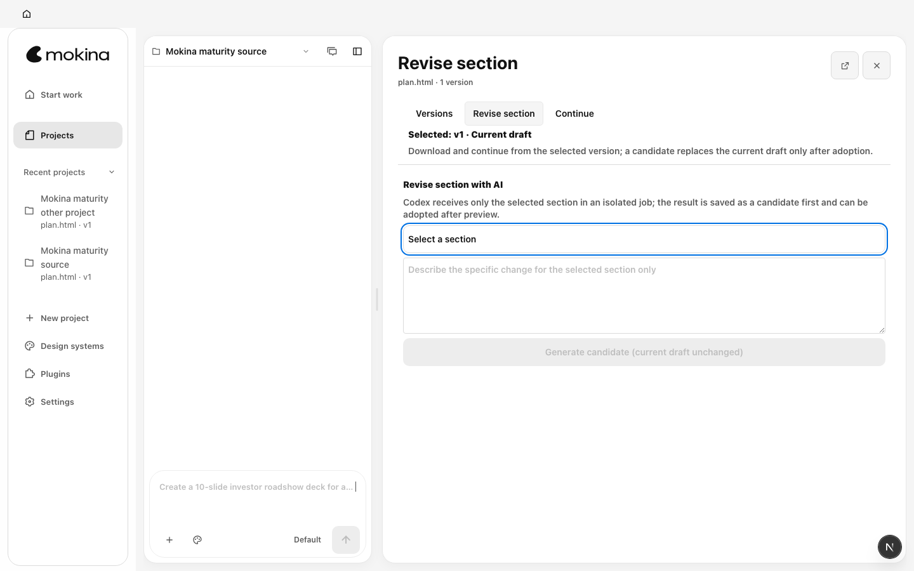
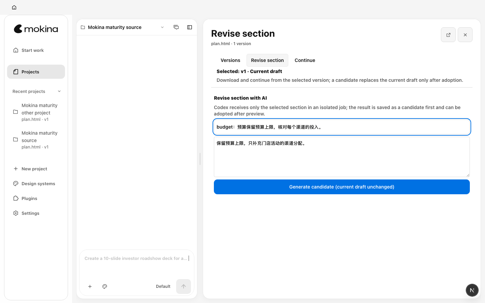
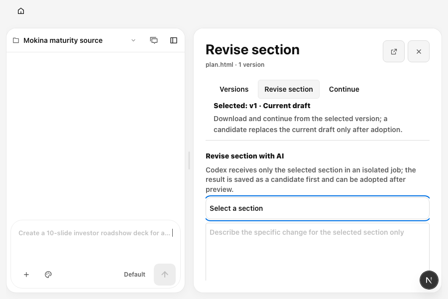
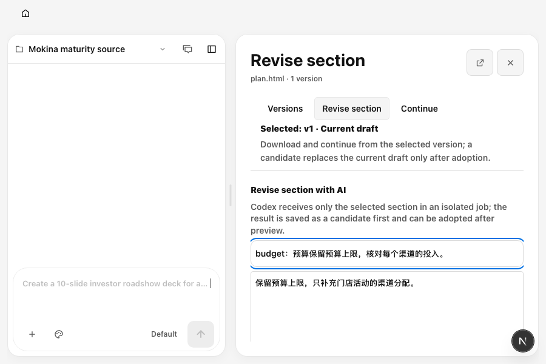

# P05 未发送章节要求恢复：同数据前后证据

2026-10-11。两轮均使用真实本地 daemon 创建相同合成内容的 `plan.html`，选择 `budget` 章节，输入“保留预算上限，只补充门店活动的渠道分配。”，然后关闭章节修订面板并重开。项目 UUID 由各轮隔离测试生成，不参与内容对照。

修复前，章节选区与要求均变空；修复后，选区与要求保留。后续浏览器步骤还核对刷新、进入另一项目填写不同要求再返回，原项目草稿仍保持独立，整个草稿操作没有创建项目或模型运行。

| 实际视口 | 面板尺寸及位置 | 横向溢出 |
|---|---|---|
| 1440 × 900 | 824 × 830，x=603、y=57 | 0 px |
| 900 × 600 | 498 × 530，x=389、y=57 | 0 px |

## 1440 × 900

修复前关闭重开：

修复后关闭重开：

## 900 × 600

修复前关闭重开：

修复后关闭重开：

完整逐页截图、实际尺寸、红绿日志和浏览器 JSON 报告位于 `output/maturity-2026-10-11/`。这里仅提交四张与本轮产品行为变化直接相关的对照图；它们不代表原生模型连接、所有屏幕或用户视觉签收。
