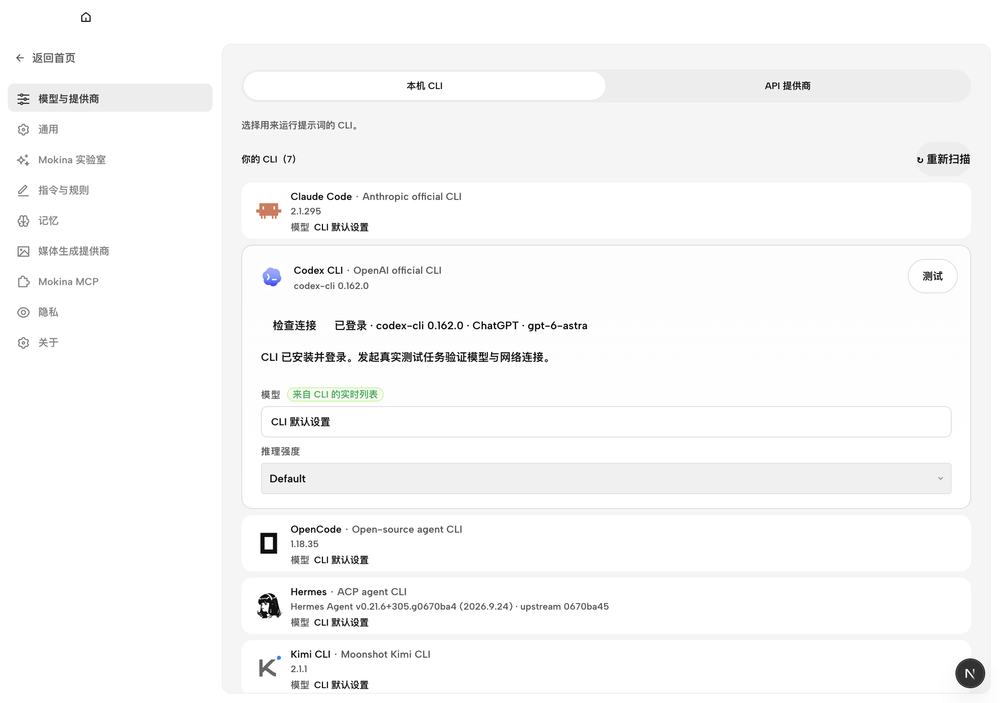
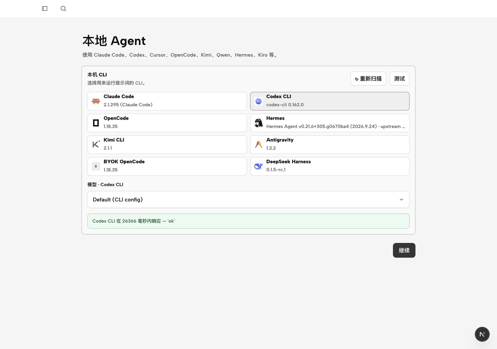

# 原生与连接诊断证据

日期：2026-10-11。以下是本轮源码开发宿主的实际证据，起点为 `247dbc398967664acf1b05f49e056b5ca93e38d9`；最终安装候选须绑定最终提交另行验证。现用 `0.0.4-local.1` 未启动、未覆盖，不代表本轮改动。

## 已确认的问题与改进

1. 当前 Codex CLI 的 `login status` 将 `Logged in using ChatGPT` 写入 stderr，并以 0 退出。原探测只读取 stdout，导致已登录被误报为 unknown；现在同时读取两个通道，并识别非零退出的未登录状态。
2. 登录检查现在沿用正式任务的可执行文件解析与运行环境，跟随设置中保存的 CLI 路径、配置目录；每次手动检查读取新状态，避免缓存旧登录结果。
3. 界面显示“已登录”，并提示需要真实任务验证模型与网络。它不再把登录状态等同于真实模型连接成功。

初始四个回归均先失败；修复后 12 条后端聚焦用例、3 条 Web 用例及 daemon 类型检查通过。原生开发宿主在 1280×900 CSS 视口显示如下（截图为 2× 像素）：

## 真实模型与安装身份

- 隔离 daemon 使用合成提示 `Reply with only: ok`，27.424 秒返回 `ok`、退出码 0。当前 CLI 为 0.162.0；响应的模型字段为 `default`，没有实际 resolvedModel，所以配置显示的模型名不作为响应模型身份的证明。
- 随后开发宿主首次 onboarding 自动触发一次测试，26.366 秒返回 `ok`。实际共两次调用：一次显式诊断、一次产品自动检查；没有失败重试，没有扩大 45 秒预算。后续候选验证会预置 onboarding 配置，避免再次自动调用。
- 历史 0.160.0 的 45 秒超时本轮未复现，不能反推当时原因。当前诊断含本机外部 MCP 可执行文件缺失告警，但未阻断本轮返回，未将此外部配置修改纳入项目范围。
- 现用 `0.0.4-local.1` 为 `ai.mainquest.mokina.preview`、arm64、adhoc；`codesign --verify --deep --strict` 通过，Mokina 图标与当前源码 ICNS 字节相同。旧包只完成只读身份核查。

## 生命周期与清理

测试通过 `tools-dev` 的独立 namespace 和显式 OD_DATA_DIR 运行。daemon、web、desktop 已停止，两个临时端口无监听，本轮数据及运行目录已清理，LaunchServices 无本轮 namespace 条目。开发宿主复用仓库 Electron 依赖，未创建新的应用副本；现用应用与该依赖均保留。

首次启动曾遗漏 OD_DATA_DIR，随即停止且没有发送项目或模型请求。核查确认默认目录为本轮新建、只有五个启动文件、项目与会话均为空、无进程占用；保存清单后只清理这些文件与本轮空目录，没有触及既有用户数据。

完整日志、红例、安装身份、失败补采记录及清理清单保留在本地 `output/maturity-2026-10-11/native/`。本页两张截图已目视检查，只含产品界面、CLI/模型名称和版本，没有凭据、用户身份或业务资料。

最终候选的原生草稿重启验证将在候选构建完成后补充。
