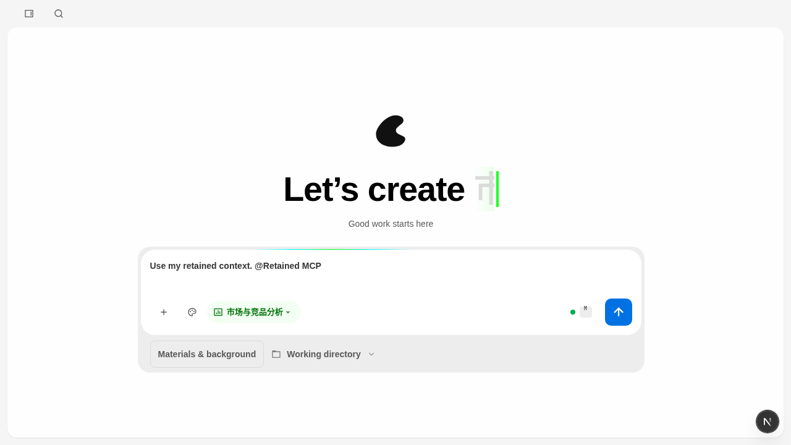
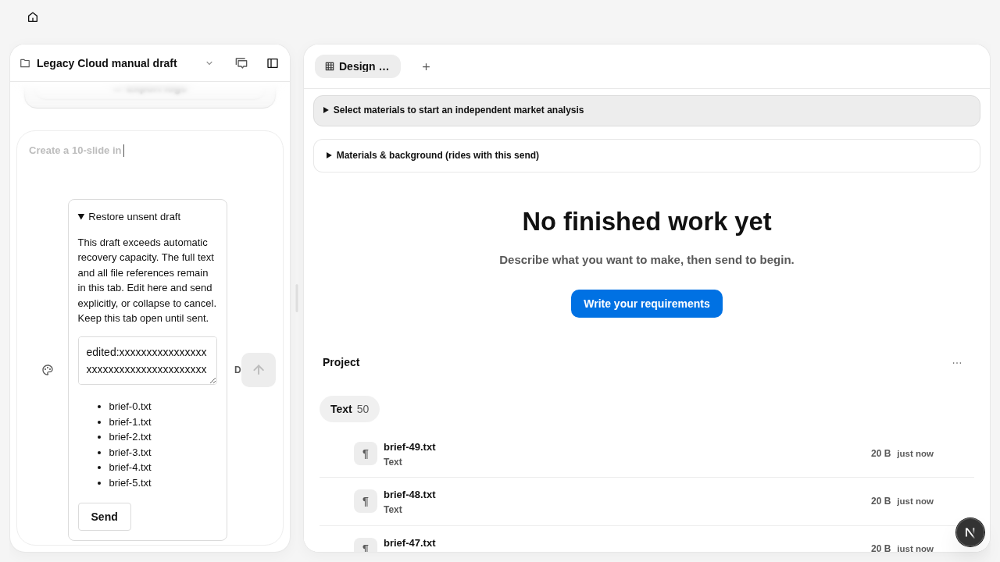
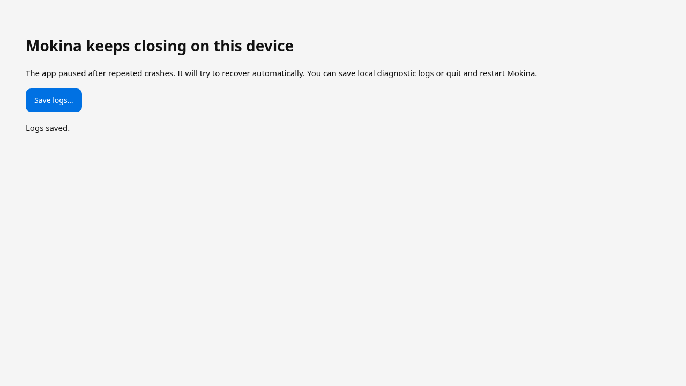
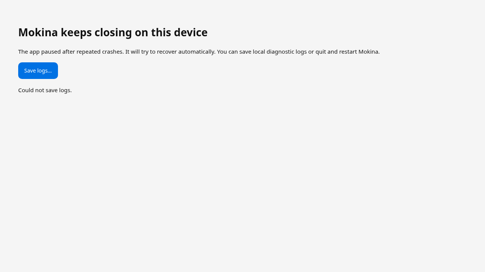

# PR13 第二轮复审定点修复

复审输入：2026-10-08 15:59 UTC 左右，Request changes，5 项 P2；没有新增 P0/P1。
基线为 `c240e99814e3afde0f760d836764ce6254ab8255`，PR13 分支 `codex/mokina-v0.0.4-brand-ui`，base `52219d8c8f71460d3776a96b9ebe84fa9ce65501`。开始和提交前分别核对远端，未重置或覆盖其他修改。

仓库指引：读取 open-design/AGENTS.md、apps/AGENTS.md、packages/AGENTS.md、e2e/AGENTS.md 及测试效率指引。环境 /workspace/.agents 为空，仓库没有 .agents/skills。首轮六项修复保留，以下为第二轮新增证据，不重标首轮历史验收。

| 复审项 | 修复及数据边界 | 回归见证 |
| --- | --- | --- |
| 1. 旧 AMR 首页上下文因模型设置跳转丢失 | 不可用模型允许原地选择本地/BYOK；阻止发送不再强制离开 Home。按工作区和标签页保留 Skill/额外插件/MCP/连接器 ID 与项目/目录引用，回来时从当前目录解析实际对象，不序列化密钥、MCP env/headers 或插件 inputs。缺失引用保持可见、阻止静默发送，允许用户明确放弃。原有本地 File 重选提示继续生效。 | InlineModelSwitcher 回归；HomeView context-recovery 的六类绑定、两次卸载/重挂、缺失引用和无密钥持久化；浏览器取消模型选择、设置往返、返回/刷新及最终运行上下文。 |
| 2. 51 个附件被裁为 50 | 在回执保存前检查完整安全 payload 是否可无损恢复。超限不裁剪、不消费 Home 来源，展示全部附件引用和独立显式发送入口。旧裁剪回执不能覆盖更完整的来源或提供误导的恢复按钮。 | 50/51 边界、旧不完整回执、刷新、完整路径集合、重复点击单次提交。 |
| 3. 65,537 字正文仅剩预览 | 超出回执容量的正文保留在原 sessionStorage 来源，完整显示在可编辑的恢复区；编辑同步回来源，刷新/换模型保持，收起即可取消。本标签页关闭不承诺恢复，界面明确提示发送前保留标签页。容量/存储失败也有全文出口。 | 65,536/65,537 边界、全文相等、编辑后刷新、取消、显式发送前零生成 POST。 |
| 4. Mokina 分享使用上游 repo | 分享 DTO 增加可选 edition，Mokina 使用 MainQuestAI/Mokina，缺省/upstream 保持 nexu-io/open-design。FileViewer 的本地 fallback 和服务端 payload 使用同一 edition；品牌替换发生在用户标题/成果 URL 插值前。 | 中英文复制文本/正文、用户标题和 URL、平台 query 参数；不发布帖子。 |
| 5. Window.status 冲突 | 生成 HTML 使用 statusEl，避免全局字符串属性冲突；诊断调用放进 Promise 链，覆盖同步 throw 和异步 reject。 | 执行生成脚本的 VM + 真实 Chromium DOM，保存中、成功、失败、取消、异常、按钮恢复。 |

## 复现与验证方式

先在未修复源码运行红色回归：日志交互 5 失败/2 通过；手动转交 2 失败/1 边界通过；分享 2 失败/2 上游通过；旧 AMR 内联模型 1 失败/3 上游通过。证据为隔离组件/函数执行，不宣称是 macOS 安装包验收。

最终命令及结果见 [evidence/rereview](evidence/rereview)。Web 定向 119/119、desktop 生成脚本及启动阶段 13/13、分享契约 4/4、daemon 上下文 3/3；套件有重叠，不合计唯一总数。workspace/Web/e2e typecheck、guard、i18n 检查和 production standalone Web build 均通过。初次环境检出 main 的 node_modules 缺少 PR13 新依赖链接，按锁文件重新安装后验证。pnpm 固定 10.33.2、Node 24.19.0。初次浏览器断言错误地按对象读取实际为字符串数组的附件路径，已纠正；另一次运行出现页面加载失败，当时 workspace pretypecheck 正在重建共享 dist；原因未单独证明。该次不计通过，之后按先构建、再浏览器顺序重跑。所有中途失败和修正均保留说明，不以 retry-only pass 充当完成。

## Adjacent issues

现有提及插入/左边界解析存在相邻缺陷：正文以句号结尾且无空格时，从加号菜单插入 MCP 得到 `context.@Retained MCP`，`mentionTokenPresent` 返回 false，提交时丢弃该项；`context. @Retained MCP` 返回 true。这与设置往返无关，原始 `c240e998` 和当前 `inlineMentions.ts` 的 SHA-256 均为 `44b015731368eae7d2bb0d78e09e8a9f8512bc6c91a61fa9f0cef5014df33974`，本轮未改解析器。按仓库 Bug follow-up workflow 将提及插入/解析的修复留给单独任务，不扩大本轮导航恢复范围。浏览器回归明确断言有效的带空格提及前提，再检查设置往返、刷新及实际 metadata；不能据此宣称所有提及格式都已修好。

完整浏览器首轮 28/30：Home 场景最初误把项目 metadata 绑定当作 runs.context，修正后识别上述无空格前提；另一项仍断言旧的强制 Settings 导航。修正有效提及前提及新内联选择行为后，两项各重复两次，4/4 通过；最终完整 Chromium 轮次 **30/30 通过（8.2 分钟，0 retry/0 flaky）**，edition-off **1/1**。机器逐用例结果见 [browser-results.json](evidence/rereview/browser-results.json)。

## 验收限制

- 本轮不是独立复审批准；仍需对最终提交复审。
- 云端未运行 Electron/macOS 同安装包、Finder/Dock/关于/离线启动、VoiceOver、原生保存对话框和安装候选签收。Chromium 运行真实生成 HTML，诊断桥是可控测试桥。
- 浏览器使用隔离 tools-dev daemon，真实项目和文件 API；模型/执行结果由测试替身控制，未调用真实付费模型，也未发布真实社媒内容。
- 超限恢复保留原标签页 sessionStorage 和完整可编辑来源，不宣称新增跨标签页关闭或跨 origin 的无限容量持久化。
- 未生成新的 DMG/ZIP，未合并、部署或正式发布。原 19 条 AC 保持原记录：1 条边界通过、17 条 partial、1 条同包签收 blocked。

## 交互截图

