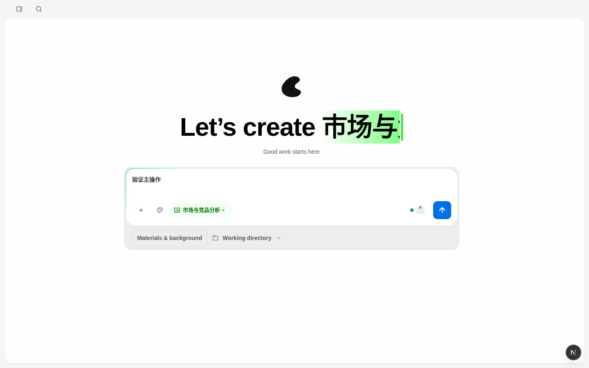
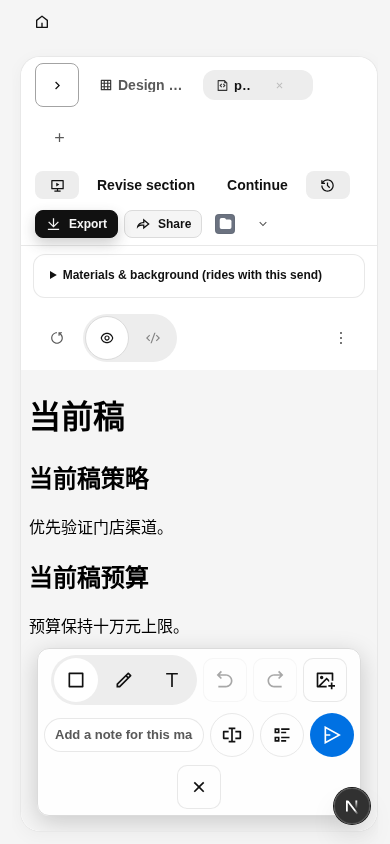

# v0.0.4 PR 首轮修复记录

2026-10-08。[PR #13](https://github.com/MainQuestAI/Mokina/pull/13) 首轮 review 的 1 项 P1、5 项 P2 已修复并完成本地验证。用户明确要求制定方案后“开始实施”；附件中的执行提示与历史批准不作为新的发布授权。

产品源码冻结于 `16e995385e21615e40c04a59f253032a011bc38a`，检查、浏览器断言和 CI 冻结于 `ecd6fc5e5d6100d969b95248404ad768dafbb940`。此后的证据提交只更新本目录。首轮 review head 为 `c7f597ddfbc8a8db309b1cbe3da7024d3610f1a3`，原始测试和截图保留为历史。

## 六项修复

| 原问题 | 修复行为 | 复核证据 |
|---|---|---|
| P1：旧 Cloud Home 输入在换模型后自动续发 | 在设置改变或异步保存前锁定手动接续；通过既有 scoped send-request 记录转交完整可恢复草稿，成功确认转交后才消费 Home 来源。设置返回、重载均不能自动生成。保存失败保留来源，显式放弃同时清除来源，防止再次进入时复活。 | ProjectView 新增完整 payload/换模型/重挂载/显式发送、保存失败、放弃、普通 Home on/off 回归；真实浏览器执行设置切换→返回→刷新→显式 Send，并断言此前生成 POST 为零、点击后恰好一次。 |
| P2：访问限制正文被 Cloud 文案覆盖 | 错误标题、说明和设置 CTA 使用一致的访问错误优先级；只读与消息不可用说明保留。 | ChatPane 两项访问限制回归及原有错误阶梯。 |
| P2：系统字体 token 未作用于真实正文/首页标题 | Mokina 作用域接入 `--sans`、`--serif`，首页标题覆盖旧 serif。代码字体和生成文档 iframe 沿原契约。 | 1440/1280/390 实际页面 computed style；另验证生产 CSS 顺序和 lazy App CSS，off edition 保留原字体。 |
| P2：画布与内容面板角色混用 | 应用画布使用 `--mokina-canvas`，工作区内容面板使用 `--surface`；实际背景为 #f5f5f5 / 白色。 | 真实首页/工作台及生产 CSS computed style。 |
| P2：绘画图标只有 30×44 命中区 | Mokina 的实际 inline 尺寸、flex 与 min-width 统一为44；工具、子工具和关闭操作允许窄屏换行，作用域颜色、焦点和玻璃参数沿 token。 | 1280/390 实际可见按钮与输入边界全部位于工具条/视口内，目标按钮≥44×44；打开、关闭沿真实入口。上游30px/nowrap 数值保留。 |
| P2：桌面 namespace 使用宽泛前缀 | desktop 的四处识别调用共用 `isMokinaLocalNamespace`；只接受名称本身或 `-`、`_`、`.` 分隔扩展。 | release 新增 `mokina-locality` 负例；9项共享规则测试、desktop typecheck/build 与定向启动测试。 |

手动接续复用既有 composer extras 安全恢复契约；无法安全持久化的插件上下文仍要求重新选择，不能恢复秘密或自动重新绑定。普通本地 Home 首次提交与显式本地重试的原门控保留。未新增资料 schema、迁移、存储状态系统或原生安装候选。

窄屏复核还修复了 `.ws-tabs-shell` 固定高度在换行后覆盖预览菜单的问题：Mokina 布局按实际行高展开，操作组可换行。390px 绘画用例先使用真实折叠会话按钮腾出预览宽度，再从预览菜单进入 Mark。无强制点击。工具栏的 `scrollWidth` 会计入未显示的附件 tooltip，因此最终断言检查所有可见交互控件的真实边界；原始 scrollWidth 与边界仍写入 JSON，没有通过裁剪菜单掩盖溢出。

## 验证

| 检查 | 本次结果 |
|---|---|
| Web 定向组件/恢复/布局 | 11文件，171通过，0跳过 |
| release namespace | 1文件，9通过 |
| desktop 启动/诊断 | 5文件，17通过 |
| pack 品牌资源/mac identity | 2文件，7通过 |
| Mokina on 真实浏览器 | 4文件，25通过，0失败/跳过/重试 |
| Mokina off 真实浏览器 | 1文件，1通过 |
| workspace typecheck、guard、i18n | 通过 |
| Mokina standalone production build | 通过；验证 dist 的自动生成 include 已还原 |
| 生产 CSS 顺序/字体/背景 | 通过；使用编译产物与最小宿主 DOM，范围不等同于完整生产应用 E2E |

各 suite 有重叠，不相加为唯一总数。逐次源码、日志和重跑命令见 [test-evidence.json](test-evidence.json) / [commands.txt](evidence/commands.txt)。on 浏览器运行开始时产品与浏览器测试已冻结，运行中提交的 `ecd6fc5e` 仅记录已有检查改动；所执行字节一致。截图使用隔离 E2E 数据，无真实模型付费请求。之前调试失败不计作通过，本表来自修复后的最终运行。

远端完整 [Mokina PR checks](https://github.com/MainQuestAI/Mokina/actions/runs/37797449606) 已在 `ecd6fc5e` 通过（包括真实 daemon 与回归浏览器）。后续证据提交会触发独立新 run，最终 head 状态以 PR checks 为准。本轮不将“已修复六项 review”解释为“原生验收完成”：PR 保持 Draft，macOS 同包、VoiceOver、性能基线、Logo 与用户视觉/业务签收仍按 [runbook](runbook.md) 待验；正式品牌发布保持 blocked。

